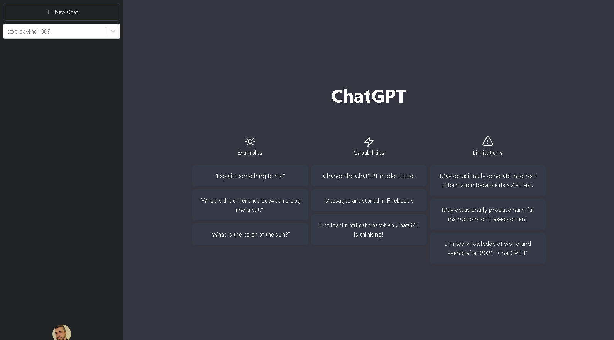
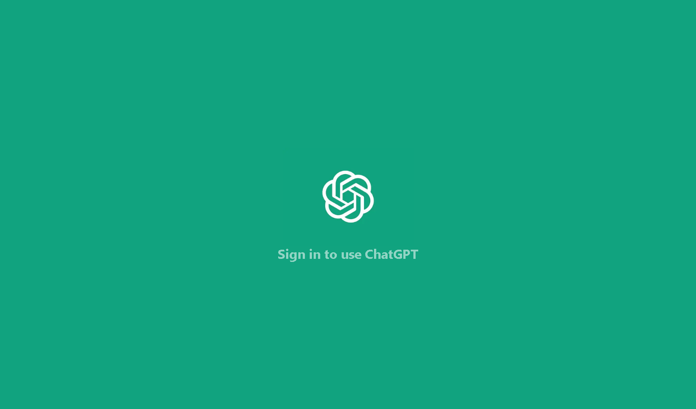
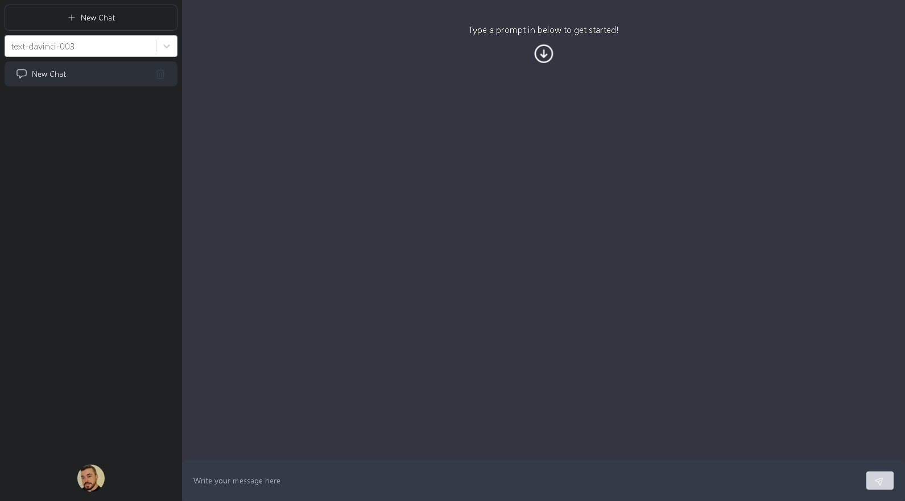
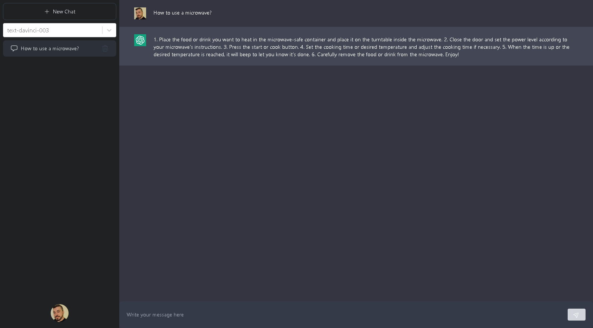

<p align="center">
  
</p>
<h1 align="center">
ChatGPT  APP V3.5
</h1>

## About
This was a clone that I made of the chatGPT website using the chatgpt api version 3.5 and implementing some technologies that I'm studying like 
firebase, tailwind and SWR.

# Layout


# LogIn Page


# Chat Layout


# ChatGPT API ANSWER



<br/>


## Technology
- JavaScript
- TypeScript
- React
- Firebase
- TailwindCSS
- NodeJS
- OpenAI(ChatGPT API)

## Framework

- NextJS 13

## Libraries

- SWR
- Next-Auth
- React Firebase Hooks
- React Hot Toast
- React Select
- HeroIcons


## Author

<div align="center">

<h1>Glendson Garcete</h1>
<strong>FullStack Developer</strong>
<br/>
<br/>

<a href="https://www.linkedin.com/in/glendson-zeus-tomazetto-garcete-a2a0b190/" target="_blank">

</a>

<a href="https://github.com/glendson" target="_blank">

</a>

<a href="mailto:gztomazetto@gmail.com?subject=Fala%20Dev" target="_blank">

</a>


<br/>
<br/>
</div>


## Getting Started

First, run the development server:

```bash
npm run dev
# or
yarn dev
# or
pnpm dev
```

Open [http://localhost:3000](http://localhost:3000) with your browser to see the result.

You can start editing the page by modifying `pages/index.tsx`. The page auto-updates as you edit the file.

